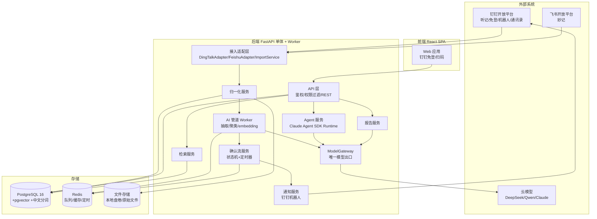
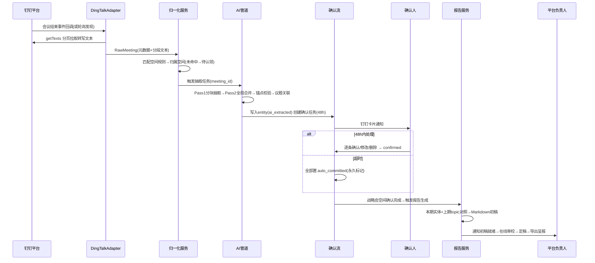
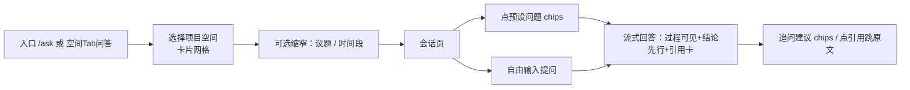

# 开发文档：会议资产中台 1.0（AI 开发执行版）

- 文档版本：v1.0
- 日期：2026-08-12
- 用途：本文档为 **PRD + 技术方案二合一的开发执行文档**，交付给 AI 开发者（GPT-5.6 等）直接按此实现。本文档自包含，无需阅读其他文档即可开发。
- UI 设计规范：严格遵循仓库根目录 [`DESIGN_GUIDE.md`](../DESIGN_GUIDE.md)（品牌蓝设计系统），本文第 12 章有落地约定。

---

## 0. 给 AI 开发者的执行说明

1. 按第 14 章"里程碑与任务分解"的顺序开发，每个任务完成后必须满足对应验收标准。
2. 所有 LLM 调用必须经过 `ModelGateway`（见 11.2），禁止在业务代码中直接 import 模型 SDK。
3. 所有数据可见性必须经过空间权限过滤（见第 10 章），禁止任何绕过空间校验的查询路径。
4. 抽取实体必须带原文锚点，锚点校验失败的实体直接丢弃（见 11.4），宁可漏、不可编。
5. 原始逐字稿与导入文件**永不物理删除**，只允许逻辑归档。
6. 前端所有颜色/圆角/阴影/字号必须使用 `DESIGN_GUIDE.md` 定义的 token，禁止自造样式值。
7. 遇到本文档未覆盖的决策点：选择最简单的可行实现，并在 `docs/DECISIONS.md` 中记录一行决策日志。

## 1. 项目概述与术语

**一句话**：对接钉钉/飞书/腾讯会议，把战略会与重点项目会的逐字稿沉淀为统一档案，用 AI 抽取结构化实体（决策/承诺/风险），产出月度复盘报告、议题时间线与可溯源检索。

**1.0 北极星**：每次月度战略会后 72 小时内，自动生成一份可呈报总经理的复盘报告初稿。

| 术语 | 定义 |
| --- | --- |
| 空间 Space | 权限与组织的基本单元（如"战略会空间"），绑定成员白名单、密级、固定确认人 |
| 会议档案 Meeting | 一场会议的全部沉淀：元数据+逐字稿+平台纪要+抽取实体 |
| 逐字稿 Transcript | 分段存储的会议原文，每段含发言人与时间戳，是全系统的事实源 |
| 实体 Entity | AI 从逐字稿抽取的结构化对象，1.0 三类：决策 decision / 承诺 commitment / 风险 risk |
| 锚点 Anchor | 实体引用的逐字稿段落 id 列表，保证任何结论可跳回原文 |
| 议题 Topic | 跨会议聚类的讨论主题（如"华东渠道改革"），时间线与跨会对照的基础 |
| 确认流 | AI 抽取 → 确认人 48h 校正窗口 → 超时默认采纳并永久标记 的状态机 |

## 2. 功能清单（完整版）

优先级：P0=1.0 必须；P1=1.0 应有；P2=后续版本（本次只留接口/表结构，不实现）。

| 编号 | 模块 | 功能 | 说明 | 优先级 |
| --- | --- | --- | --- | --- |
| F1.1 | 接入 | 钉钉自动拉取 | 会议结束后自动拉取云录制转写文本（AI 听记），事件回调+轮询兜底 | P0 |
| F1.2 | 接入 | 飞书妙记拉取 | bot 身份拉取妙记逐字稿+AI 产物；支持粘贴妙记链接触发 | P0 |
| F1.3 | 接入 | 人工导入 | 上传 txt/srt/docx/pdf 或粘贴文本，填写元数据入库 | P0 |
| F1.4 | 接入 | 批量历史回灌 | zip+元数据CSV 批量导入，导入后统一跑抽取管道 | P0 |
| F1.5 | 接入 | 待认领队列 | 拉到但未命中空间匹配规则的会议进入待认领列表，管理员手动归属 | P1 |
| F1.6 | 接入 | 腾讯会议自动拉取 | REST API 拉转写与智能纪要 | P2(1.1) |
| F2.1 | 档案 | 会议档案页 | 元数据+逐字稿（分段/发言人/时间戳/锚点定位）+平台纪要+实体清单 | P0 |
| F2.2 | 档案 | 会议列表 | 空间内按时间倒序，状态标识（已入库/抽取中/待确认/完成） | P0 |
| F2.3 | 档案 | 原文永久保留 | 逻辑归档代替删除，仅全局管理员可归档 | P0 |
| F3.1 | 抽取 | 实体抽取管道 | 两遍抽取+锚点校验+议题关联，输出三类实体 | P0 |
| F3.2 | 抽取 | 抽取重跑 | 对任意会议手动触发重新抽取（版本号区分，旧版本保留） | P1 |
| F4.1 | 确认流 | 确认任务与通知 | 抽取完成后钉钉卡片通知确认人 | P0 |
| F4.2 | 确认流 | 确认页 | 逐条确认/修改/删除/补录，一键全部确认 | P0 |
| F4.3 | 确认流 | 48h 超时自动入库 | 超时实体置 auto_committed，永久标记 | P0 |
| F4.4 | 确认流 | 修订留痕 | 实体任何修改记录 revision，可查历史 | P0 |
| F5.1 | 资产库 | 实体库 | 三类实体清单，按议题/人/时间/会议/状态筛选 | P0 |
| F5.2 | 资产库 | 全文检索 | 跨空间（按权限）检索逐字稿+实体，关键词+语义混合 | P0 |
| F5.3 | 资产库 | 原文溯源 | 实体/检索结果一键跳转逐字稿段落并高亮 | P0 |
| F5.4 | 资产库 | 议题时间线 | 议题在历次会议中的演变视图 | P0 |
| F5.5 | 资产库 | 议题管理 | 手动合并/拆分/重命名议题 | P1 |
| F6.1 | 报告 | 月度复盘报告生成 | 确认完成后自动生成；也可手动指定空间+时段生成 | P0 |
| F6.2 | 报告 | 报告在线审校 | Markdown 编辑器，负责人编辑并标记定稿 | P0 |
| F6.3 | 报告 | 报告导出 | Word/PDF 导出 | P1 |
| F6.4 | 报告 | 跨会对照 | 报告中"上期议题本期进展"章节（纯内容对照，无执行状态判断） | P0 |
| F7.1 | 权限 | 空间管理 | 创建空间、密级、成员白名单、确认人、会议匹配规则 | P0 |
| F7.2 | 权限 | 钉钉免登 | 钉钉工作台内免登；浏览器钉钉扫码登录 | P0 |
| F7.3 | 权限 | 行级权限过滤 | 一切查询按空间成员关系过滤 | P0 |
| F8.1 | 通知 | 钉钉机器人通知 | 确认任务/报告就绪/拉取失败告警 三类 | P0 |
| F9.1 | 审计 | 审计日志 | 登录、查看敏感内容、实体修订、管理操作全记录，管理员可查 | P0 |
| F10.1 | Agent | 复盘问答 Agent | 选定项目空间后自然语言对话，Agent 查库溯源作答（详见 11.9） | P0 |
| F10.2 | Agent | 二次复盘 | 换模型/换 prompt 对历史原文重跑抽取并对比 | P1 |
| F10.3 | Agent | 预置研判分析 | 承诺后续追踪、议而不决检测、风险演变等预设分析（问答内 chips + 空间洞察卡片） | P1 |
| F10.4 | Agent | 承诺/风险提及追踪预计算 | 新会议入库后自动匹配本空间既有承诺/风险的后续提及（entity_mention），研判分析的数据基础 | P1 |

**明确不做（1.0）**：自建音视频会议、实时转写、待办执行状态跟踪（任务系统/执行考核）、会前简报推送、分歧点与数据口径实体、实体级脱敏、模型私有化。
**边界说明**：F10.3/F10.4 的"承诺追踪"只研判**会议内容中的提及轨迹**（后续会议是否提及、宣称完成还是再无下文），不判断事项真实执行状态、不做任务管理，与被搁置的"待办执行状态跟踪"（1.5）是两回事。

## 3. 总体架构



组件职责一览：

| 组件 | 职责 | 不负责 |
| --- | --- | --- |
| API 层 | REST 接口、登录鉴权、每请求空间权限校验 | 业务编排细节 |
| 接入适配层 | 各平台拉取/回调/导入，输出统一 RawMeeting | 抽取、权限 |
| 归一化服务 | RawMeeting → 统一数据模型落库，原始文件归档 | 平台差异处理（适配层做） |
| AI 管道 Worker | 异步执行抽取/embedding/聚类任务 | 同步请求处理 |
| Agent 服务 | 承载 Claude Agent SDK 运行时与工具集（见 11.5） | 确定性管道任务 |
| 确认流服务 | 状态机、48h 定时器、确认任务 | 实体内容生成 |
| 报告服务 | 报告组装、跨会对照、导出 | 数据抽取 |
| ModelGateway | 所有 LLM/embedding 调用的唯一出口，供应商路由、重试、用量记账 | 业务逻辑 |

## 4. 技术栈（锁定版本）

| 层 | 选型 | 说明 |
| --- | --- | --- |
| 后端 | Python 3.12 + FastAPI + SQLAlchemy 2 + Pydantic v2 | 单体应用 |
| 异步任务 | arq（Redis 队列）| 抽取任务、轮询调度、48h 定时器 |
| 数据库 | PostgreSQL 16 + pgvector + pg_jieba（或 zhparser）| 关系+向量+中文全文一库 |
| Agent 底座 | **claude-agent-sdk（Python）** | 见 11.5；备选 pi-agent-core 见 11.7 |
| 模型调用 | litellm（网关内部路由）+ anthropic SDK（Agent 部分）| 见 11.2 |
| 前端 | React 18 + Vite + TypeScript + TailwindCSS + antd 5 | Tailwind 承载 DESIGN_GUIDE token |
| 前端状态/请求 | @tanstack/react-query + zustand | |
| Markdown 编辑 | bytemd 或 milkdown | 报告审校 |
| 导出 | pandoc（容器内）| Word/PDF |
| 部署 | Docker Compose（web/api/worker/postgres/redis）| 单机 4C16G |

## 5. 端到端数据流转

### 5.1 钉钉自动接入 → 报告全链路（主流程）



### 5.2 各板块输入/输出总表

| 板块 | 输入 | 输出 | 触发方式 |
| --- | --- | --- | --- |
| 钉钉 Adapter | 会议结束事件 / 轮询；conferenceId | RawMeeting{platform:"dingtalk", meta, segments[]} | 事件回调 + 每30分钟轮询 |
| 飞书 Adapter | 妙记链接（minute_token）/ 轮询 | RawMeeting{platform:"feishu", meta, segments[], artifacts[]} | 用户粘贴链接 / 轮询 |
| 人工导入 | 文件(txt/srt/docx/pdf)或文本 + 元数据表单 | RawMeeting{platform:"manual", ...} | 用户上传 |
| 归一化服务 | RawMeeting | meeting + transcript_segment[] 落库；原始文件归档；抽取任务入队 | 适配层调用 |
| AI 抽取管道 | meeting_id（读取 segments + platform_artifact） | entity[]（status=ai_extracted, 带锚点+topic_id）+ confirmation_task | 队列任务 |
| 确认流 | 确认人操作 / 48h 定时器 | entity 状态变更 + entity_revision + 报告触发信号 | 用户操作 / 定时 |
| 检索服务 | query 文本 + 用户身份 | 命中列表（segment/entity，含空间过滤、锚点） | API 请求 |
| 议题时间线 | topic_id + 用户身份 | 按会议时间排序的节点列表（每节点含该会相关实体） | API 请求 |
| 报告服务 | space_id + 时段（自动=本期会议） | report(draft, Markdown) + 通知 | 确认完成 / 手动 |
| Agent 服务（问答） | 会话范围（空间/议题）+ 用户问题 + 用户身份 | 带溯源引用的回答（SSE 流式，含工具调用过程事件） | 问答会话 API |
| 提及追踪预计算 | 新入库会议的 segments + 本空间未闭环承诺/风险 | entity_mention 记录（提及类型+相似度+锚点） | 归一化落库后队列任务 |
| 通知服务 | 事件(确认任务/报告就绪/拉取失败) | 钉钉工作通知卡片 | 各服务调用 |

## 6. 模块规格（输入/输出/接口契约）

> 每个模块给出：职责、对外接口、输入输出契约、边界与错误处理、验收标准。内部函数签名由开发者自定，但对外契约不可变更。

### M1 认证与用户

- **职责**：钉钉免登（应用内 `dd.getAuthCode` → 后端换 userId）、浏览器扫码 OAuth、签发本系统 JWT（含 user_id，2h 有效+刷新）、用户主数据同步。
- **输入**：authCode（免登）/ OAuth code（扫码）。
- **输出**：JWT；`app_user` 记录（首登自动创建，仅当该钉钉 userId 在任一空间白名单内，否则 403"未被邀请"）。
- **边界**：钉钉接口失败→登录页给出可重试错误；JWT 过期→前端静默刷新。
- **验收**：钉钉工作台内打开应用零点击进入工作台页；非白名单用户看到统一"无权限"页。

### M2 空间与权限

- **职责**：空间 CRUD、成员白名单管理、确认人指定、会议匹配规则配置；提供权限过滤器 `visible_space_ids(user_id)` 供全系统复用。
- **匹配规则结构**（space.match_rules，jsonb 数组，命中任一即归属）：

```json
[
  {"type": "organizer", "platform": "dingtalk", "value": "钉钉userId"},
  {"type": "title_keyword", "value": "月度战略会"},
  {"type": "recurring_meeting_id", "platform": "dingtalk", "value": "xxx"}
]
```

- **验收**：非成员访问空间任何资源返回 403；检索/时间线结果不含无权空间数据（用双账号测试）。

### M3 接入适配层

统一输出契约 **RawMeeting**（所有 Adapter 必须产出此结构）：

```json
{
  "platform": "dingtalk | feishu | tencent | manual",
  "source_ref": {"conferenceId": "..."},
  "title": "8月月度战略会",
  "held_at": "2026-08-05T14:00:00+08:00",
  "participants": [{"name": "张三", "platform_user_id": "union_xxx"}],
  "segments": [
    {"seq": 1, "speaker_name": "张三", "speaker_platform_id": "union_xxx",
     "start_ms": 0, "end_ms": 8200, "text": "……"}
  ],
  "artifacts": [{"kind": "platform_summary", "content": "...", "raw": {}}],
  "raw_files": [{"filename": "transcript.srt", "path": "/data/raw/..."}]
}
```

**M3.1 DingTalkAdapter**
- 接口：钉钉 `GET /v1.0/conference/videoConferences/{conferenceId}/cloudRecords/getTexts`（分页 nextToken，maxResults=2000），权限 `VideoConference.Conference.Read`。
- 发现机制：订阅会议结束/录制完成事件（HTTP 回调，需验签）；兜底轮询：每 30 分钟对各空间 match_rules 中的 recurring_meeting_id/organizer 扫描近 24h 会议。
- 错误处理：无录制 → 记录"无数据"状态并通知负责人；接口限流 → 指数退避重试 3 次后告警。
- 验收：mock 钉钉接口的集成测试通过；真实试点会议会后 1 小时内档案出现。

**M3.2 FeishuAdapter**
- 接口：`GET /open-apis/minutes/v1/minutes/{minute_token}/transcript?need_speaker=true&need_timestamp=true&file_format=srt`（tenant_access_token，bot 身份，限频 5/s），权限 `minutes:minutes.transcript:export`；妙记详情接口拉 AI 产物存 artifacts。
- 触发：前端"粘贴妙记链接"（正则提取 24 位 minute_token）；转写未就绪（错误码 2091003）→ 延迟 10 分钟重试，最多 6 次。
- 验收：粘贴链接后异步完成入库，页面可见进度状态。

**M3.3 ImportService（人工导入/批量回灌）**
- 输入：单文件或 zip+CSV（列：filename,title,held_at,space_id,participants）；解析器：srt（保留时间戳/发言人）、txt（按空行分段）、docx/pdf（抽纯文本分段，无发言人则 speaker_name=null）。
- 验收：单场导入 ≤2 分钟操作；30 场历史 zip 一次导入成功并全部入抽取队列。

### M4 归一化与档案

- **职责**：RawMeeting → 空间归属（match_rules）→ 幂等落库（platform+source_ref 唯一约束，重复拉取更新而非重复建档）→ 原始文件存档 → 入抽取队列。
- **状态机**：`ingested → extracting → confirming → done`（外加 `unclaimed` 待认领、`failed`）。
- **验收**：同一会议重复回调不产生重复档案；未命中规则的会议出现在管理员待认领列表。

### M5 AI 抽取管道（详见第 11 章）

- **输入**：meeting_id。**输出**：entity[]（ai_extracted）+ topic 关联 + confirmation_task。
- **验收**：对 golden set（见 11.8）运行，决策/承诺/风险的召回 ≥70%、锚点准确率 100%（锚点校验保证）。

### M6 确认流

- 状态机与超时定时器（arq 延迟任务，deadline 时检查）；确认操作 API 见第 9 章；全部变更写 entity_revision + audit_log。
- **验收**：模拟超时（测试环境 deadline 可配置为分钟级）后实体带 auto_committed 标记且不可清除；修订历史可回看 diff。

### M7 资产库与检索

- **实体库**：分页列表 API，过滤器（type/topic_id/person/space_id/date range/status）。
- **检索**：混合检索——pg 全文（中文分词）+ pgvector 余弦（embedding 检索 top50）→ RRF 融合排序 → 权限过滤 → 返回带高亮上下文与锚点。
- **时间线**：`topic_id → 按 held_at 排序的 meeting 节点 + 各节点实体`。
- **验收**：检索"渠道改革"能同时命中含该关键词的段落与语义相近段落；任意结果点击跳转档案页并高亮段落。

### M8 报告服务

- **触发**：空间确认任务全部关闭（done/expired）时对"报告型空间"（space 配置 report_enabled=true）自动生成；或手动 POST 指定时段。
- **组装流程**：
  1. 取本期会议实体（含 auto_committed 标记）；
  2. 取上期报告涉及的 topic 集合，与本期 topic 交集 → 对每个交集 topic，取两期实体，调用 LLM 生成"进展对照"段落（每段末尾附实体 id 引用）；
  3. 按固定模板组装 Markdown（模板见下）；
  4. 存 report(draft) → 通知负责人。
- **报告模板章节**：`# {空间名}复盘报告（{期数}）` / 一、会议概览 / 二、决策清单（表格：结论/拍板人/依据/溯源）/ 三、承诺清单（事项/责任人/期限/溯源）/ 四、风险清单 / 五、上期议题进展对照 / 附录：实体引用索引。
- **验收**：初稿中每条结论可点击溯源到实体→原文；负责人编辑保存后标记定稿；导出 docx 格式正确。

### M9 通知服务

- 钉钉工作通知（机器人）三类模板：确认任务卡片（含实体数量摘要+跳转链接）、报告就绪、拉取失败告警（发负责人）。发送失败重试 3 次，全部失败落 audit_log。

### M10 审计

- 记录事件：登录、查看会议档案/逐字稿（敏感读取）、实体确认/修订、空间与成员变更、报告定稿、导出、Agent 调用。管理员查询页支持按人/时间/类型过滤。

## 7. 数据库设计（DDL）

```sql
CREATE EXTENSION IF NOT EXISTS vector;

CREATE TABLE app_user (
  id            BIGSERIAL PRIMARY KEY,
  dingtalk_user_id TEXT UNIQUE,
  feishu_open_id   TEXT UNIQUE,
  name          TEXT NOT NULL,
  avatar_url    TEXT,
  is_global_admin BOOLEAN NOT NULL DEFAULT FALSE,
  created_at    TIMESTAMPTZ NOT NULL DEFAULT now()
);

CREATE TABLE space (
  id            BIGSERIAL PRIMARY KEY,
  name          TEXT NOT NULL,
  security_level TEXT NOT NULL CHECK (security_level IN ('exec','project')),
  confirmer_user_id BIGINT REFERENCES app_user(id),
  match_rules   JSONB NOT NULL DEFAULT '[]',
  report_enabled BOOLEAN NOT NULL DEFAULT FALSE,
  archived      BOOLEAN NOT NULL DEFAULT FALSE,
  created_at    TIMESTAMPTZ NOT NULL DEFAULT now()
);

CREATE TABLE space_member (
  space_id      BIGINT NOT NULL REFERENCES space(id),
  user_id       BIGINT NOT NULL REFERENCES app_user(id),
  role          TEXT NOT NULL CHECK (role IN ('admin','confirmer','member')),
  PRIMARY KEY (space_id, user_id)
);

CREATE TABLE meeting (
  id            BIGSERIAL PRIMARY KEY,
  space_id      BIGINT REFERENCES space(id),          -- NULL = 待认领
  title         TEXT NOT NULL,
  held_at       TIMESTAMPTZ NOT NULL,
  source        TEXT NOT NULL CHECK (source IN ('dingtalk','feishu','tencent','manual')),
  source_ref    JSONB NOT NULL DEFAULT '{}',
  participants  JSONB NOT NULL DEFAULT '[]',
  status        TEXT NOT NULL DEFAULT 'ingested'
    CHECK (status IN ('unclaimed','ingested','extracting','confirming','done','failed')),
  extraction_version INT NOT NULL DEFAULT 0,
  archived      BOOLEAN NOT NULL DEFAULT FALSE,
  created_at    TIMESTAMPTZ NOT NULL DEFAULT now(),
  UNIQUE (source, source_ref)
);

CREATE TABLE transcript_segment (
  id            BIGSERIAL PRIMARY KEY,
  meeting_id    BIGINT NOT NULL REFERENCES meeting(id),
  seq           INT NOT NULL,
  speaker_name  TEXT,
  speaker_user_id BIGINT REFERENCES app_user(id),     -- 平台ID映射成功时填
  start_ms      BIGINT, end_ms BIGINT,
  text          TEXT NOT NULL,
  embedding     vector(1024),
  UNIQUE (meeting_id, seq)
);
CREATE INDEX idx_seg_fts ON transcript_segment
  USING GIN (to_tsvector('jiebacfg', text));
CREATE INDEX idx_seg_vec ON transcript_segment
  USING hnsw (embedding vector_cosine_ops);

CREATE TABLE platform_artifact (
  id BIGSERIAL PRIMARY KEY,
  meeting_id BIGINT NOT NULL REFERENCES meeting(id),
  kind TEXT NOT NULL,            -- platform_summary/platform_todo/platform_chapter
  content TEXT, raw JSONB
);

CREATE TABLE topic (
  id BIGSERIAL PRIMARY KEY,
  space_id BIGINT NOT NULL REFERENCES space(id),
  name TEXT NOT NULL,
  summary TEXT,
  embedding vector(1024),
  merged_into BIGINT REFERENCES topic(id),            -- 议题合并
  created_at TIMESTAMPTZ NOT NULL DEFAULT now()
);

CREATE TABLE entity (
  id BIGSERIAL PRIMARY KEY,
  meeting_id BIGINT NOT NULL REFERENCES meeting(id),
  space_id   BIGINT NOT NULL REFERENCES space(id),
  topic_id   BIGINT REFERENCES topic(id),
  type       TEXT NOT NULL CHECK (type IN ('decision','commitment','risk')),
  payload    JSONB NOT NULL,
  -- decision:   {conclusion, decider, rationale, alternatives[]}
  -- commitment: {item, owner, due_date, deliverable}
  -- risk:       {description, raiser, impact, initial_status}
  anchor_segment_ids BIGINT[] NOT NULL CHECK (array_length(anchor_segment_ids,1) >= 1),
  status     TEXT NOT NULL DEFAULT 'ai_extracted'
    CHECK (status IN ('ai_extracted','confirmed','auto_committed','deleted')),
  auto_committed BOOLEAN NOT NULL DEFAULT FALSE,      -- 永久标记，置true后禁止改回
  extraction_version INT NOT NULL DEFAULT 1,
  confidence NUMERIC(3,2),
  created_at TIMESTAMPTZ NOT NULL DEFAULT now()
);
CREATE INDEX idx_entity_space ON entity(space_id, type, status);

CREATE TABLE confirmation_task (
  id BIGSERIAL PRIMARY KEY,
  meeting_id BIGINT NOT NULL REFERENCES meeting(id) UNIQUE,
  confirmer_user_id BIGINT NOT NULL REFERENCES app_user(id),
  deadline_at TIMESTAMPTZ NOT NULL,
  status TEXT NOT NULL DEFAULT 'pending' CHECK (status IN ('pending','done','expired'))
);

CREATE TABLE entity_revision (
  id BIGSERIAL PRIMARY KEY,
  entity_id BIGINT NOT NULL REFERENCES entity(id),
  editor_user_id BIGINT NOT NULL REFERENCES app_user(id),
  action TEXT NOT NULL CHECK (action IN ('confirm','edit','delete','create_manual')),
  before JSONB, after JSONB,
  edited_at TIMESTAMPTZ NOT NULL DEFAULT now()
);

CREATE TABLE report (
  id BIGSERIAL PRIMARY KEY,
  space_id BIGINT NOT NULL REFERENCES space(id),
  period_label TEXT NOT NULL,                          -- 如 "2026-08"
  meeting_ids BIGINT[] NOT NULL,
  content_md TEXT NOT NULL,
  status TEXT NOT NULL DEFAULT 'draft' CHECK (status IN ('draft','finalized')),
  finalized_by BIGINT REFERENCES app_user(id),
  created_at TIMESTAMPTZ NOT NULL DEFAULT now()
);

CREATE TABLE audit_log (
  id BIGSERIAL PRIMARY KEY,
  user_id BIGINT REFERENCES app_user(id),
  action TEXT NOT NULL,
  target_type TEXT, target_id BIGINT,
  detail JSONB,
  at TIMESTAMPTZ NOT NULL DEFAULT now()
);

CREATE TABLE llm_usage (
  id BIGSERIAL PRIMARY KEY,
  task TEXT NOT NULL,               -- extract_pass1/extract_pass2/report/embed/agent_chat/agent_replay/mention_scan
  provider TEXT NOT NULL, model TEXT NOT NULL,
  input_tokens INT, output_tokens INT, cost_estimate NUMERIC(10,4),
  meeting_id BIGINT, at TIMESTAMPTZ NOT NULL DEFAULT now()
);

-- 问答会话
CREATE TABLE chat_session (
  id BIGSERIAL PRIMARY KEY,
  user_id  BIGINT NOT NULL REFERENCES app_user(id),
  space_id BIGINT NOT NULL REFERENCES space(id),       -- 会话范围：必选空间
  topic_id BIGINT REFERENCES topic(id),                -- 可选：缩窄到议题
  date_from DATE, date_to DATE,                        -- 可选：缩窄时间段
  title TEXT,                                          -- 首问自动生成
  created_at TIMESTAMPTZ NOT NULL DEFAULT now()
);

CREATE TABLE chat_message (
  id BIGSERIAL PRIMARY KEY,
  session_id BIGINT NOT NULL REFERENCES chat_session(id),
  role TEXT NOT NULL CHECK (role IN ('user','assistant')),
  content_md TEXT NOT NULL,
  citations JSONB NOT NULL DEFAULT '[]',   -- [{entity_id?, meeting_id, segment_id, quote}]
  tool_trace JSONB,                        -- Agent 工具调用轨迹（审计与"过程可见"回放）
  created_at TIMESTAMPTZ NOT NULL DEFAULT now()
);

-- 承诺/风险的后续提及追踪（研判分析数据基础，F10.4）
CREATE TABLE entity_mention (
  id BIGSERIAL PRIMARY KEY,
  entity_id  BIGINT NOT NULL REFERENCES entity(id),    -- 被提及的承诺/风险
  meeting_id BIGINT NOT NULL REFERENCES meeting(id),   -- 提及发生在哪场后续会议
  segment_id BIGINT NOT NULL REFERENCES transcript_segment(id),
  mention_kind TEXT NOT NULL CHECK (mention_kind IN
    ('progress','done_claim','revision','blocked','mentioned')),
    -- 汇报进展/宣称完成/口径变更/受阻/仅提及
  similarity NUMERIC(3,2),
  created_at TIMESTAMPTZ NOT NULL DEFAULT now(),
  UNIQUE (entity_id, segment_id)
);
CREATE INDEX idx_mention_entity ON entity_mention(entity_id);
```

## 8. REST API 规格

统一前缀 `/api/v1`，鉴权：`Authorization: Bearer <JWT>`。响应包裹 `{code:0, data, msg}`；错误码：401 未登录 / 403 无权限 / 404 / 422 参数 / 500。

| Method | Path | 说明 | 权限 |
| --- | --- | --- | --- |
| POST | /auth/dingtalk/code | 免登 code 换 JWT | 公开 |
| GET | /auth/me | 当前用户+所属空间 | 登录 |
| GET | /spaces | 我可见的空间列表 | 登录 |
| POST | /spaces | 创建空间 | 全局管理员 |
| PUT | /spaces/{id} | 更新空间（含 match_rules/成员/确认人） | 全局管理员 |
| GET | /spaces/{id}/meetings?status=&page= | 空间会议列表 | 空间成员 |
| GET | /meetings/{id} | 档案详情（元数据+实体摘要） | 空间成员 |
| GET | /meetings/{id}/transcript?page= | 逐字稿分段（分页） | 空间成员 |
| POST | /meetings/import | 人工导入（multipart：file+meta） | 空间成员 |
| POST | /meetings/import/batch | zip+CSV 批量回灌 | 全局管理员 |
| POST | /meetings/feishu-link | 粘贴妙记链接触发拉取 {url, space_id} | 空间成员 |
| GET | /meetings/unclaimed | 待认领列表 | 全局管理员 |
| POST | /meetings/{id}/claim | 归属空间 {space_id} | 全局管理员 |
| POST | /meetings/{id}/re-extract | 重跑抽取（版本+1） | 空间admin |
| GET | /confirmations/pending | 我的待确认任务 | 确认人 |
| GET | /meetings/{id}/entities?status= | 会议实体清单 | 空间成员 |
| POST | /entities/{id}/confirm | 确认单条 | 确认人 |
| PUT | /entities/{id} | 修改（写revision） | 确认人 |
| DELETE | /entities/{id} | 删除（逻辑，写revision） | 确认人 |
| POST | /meetings/{id}/entities | 手动补录实体 | 确认人 |
| POST | /meetings/{id}/confirm-all | 一键全部确认 | 确认人 |
| GET | /entities?type=&topic_id=&person=&from=&to=&space_id= | 实体库检索 | 按空间过滤 |
| GET | /entities/{id}/revisions | 修订历史 | 空间成员 |
| GET | /search?q=&scope= | 混合检索（段落+实体） | 按空间过滤 |
| GET | /topics?space_id= | 议题列表 | 空间成员 |
| GET | /topics/{id}/timeline | 议题时间线 | 空间成员 |
| POST | /topics/merge {from_id,to_id} | 合并议题 | 空间admin |
| GET | /reports?space_id= | 报告列表 | 空间成员 |
| POST | /reports/generate {space_id, from, to} | 手动生成 | 空间admin |
| GET | /reports/{id} | 报告详情 | 空间成员 |
| PUT | /reports/{id} | 编辑内容 | 空间admin/确认人 |
| POST | /reports/{id}/finalize | 定稿 | 空间admin |
| GET | /reports/{id}/export?format=docx\|pdf | 导出 | 空间成员 |
| POST | /agent/replay {meeting_id, model?} | 二次复盘（对比抽取） | 空间admin |
| POST | /agent/sessions {space_id, topic_id?, date_from?, date_to?} | 创建问答会话（范围先行） | 空间成员 |
| GET | /agent/sessions | 我的会话列表 | 登录 |
| GET | /agent/sessions/{id} | 会话详情（含消息与引用） | 会话所有者 |
| POST | /agent/sessions/{id}/messages {content} | 提问，**SSE 流式**返回（事件类型见下） | 会话所有者 |
| GET | /agent/suggestions?space_id=&topic_id= | 预设问题 chips（含研判类） | 空间成员 |
| GET | /spaces/{id}/insights | 空间洞察卡片（预置研判摘要，见 11.9.4） | 空间成员 |
| GET | /admin/audit?user=&action=&from= | 审计查询 | 全局管理员 |

问答 SSE 事件流格式（`POST /agent/sessions/{id}/messages` 响应）：

```text
event: status    data: {"text": "正在查阅 6月战略会 逐字稿…"}     ← 每次工具调用推送，前端展示工作过程
event: delta     data: {"text": "……"}                            ← 回答正文增量
event: citation  data: {"index": 1, "meeting_id": 11, "segment_id": 901, "quote": "…"}
event: done      data: {"message_id": 55, "suggestions": ["后续追问建议1", "…"]}
```

关键接口示例——`POST /entities/{id}/confirm` 响应：

```json
{"code":0, "data":{"id":123, "status":"confirmed", "auto_committed":false}}
```

`GET /topics/{id}/timeline` 响应：

```json
{"code":0, "data":{
  "topic":{"id":7,"name":"华东渠道改革"},
  "nodes":[
    {"meeting":{"id":11,"title":"6月战略会","held_at":"2026-06-03"},
     "entities":[{"id":88,"type":"decision","payload":{"conclusion":"..."},"anchor_segment_ids":[901]}]}
  ]}}
```

## 9. 权限设计（完整）

### 9.1 角色与能力矩阵

| 能力 | 全局管理员 | 空间admin | 确认人 | 空间成员 | 非成员 |
| --- | --- | --- | --- | --- | --- |
| 空间创建/成员/规则管理 | ✓ | 本空间成员管理 | – | – | – |
| 查看档案/逐字稿/实体/报告 | ✓(全部) | 本空间 | 本空间 | 本空间 | ✗ |
| 实体确认/修订/补录 | – | – | ✓ | – | ✗ |
| 报告生成/编辑/定稿 | ✓ | ✓ | 编辑 | 只读 | ✗ |
| 手动导入 | ✓ | ✓ | ✓ | ✓(本空间) | ✗ |
| 重跑抽取/二次复盘 | ✓ | ✓ | – | – | ✗ |
| 审计查询 | ✓ | – | – | – | ✗ |
| 归档会议 | ✓ | – | – | – | ✗ |

### 9.2 鉴权实现链路

1. **认证**：JWT 中只放 user_id；每请求查 Redis 缓存的用户-空间关系（TTL 60s，成员变更时主动失效）。
2. **接口级**：FastAPI dependency `require_role(space_id, roles)` 装饰所有空间资源接口。
3. **行级**：所有列表/检索查询强制拼接 `WHERE space_id = ANY(:visible_space_ids)`；封装成 SQLAlchemy 查询基类，禁止业务层手写绕过。
4. **Agent 层**：Agent 工具调用同样携带 user_id 上下文，工具内部走同一套 visible_space_ids 过滤（见 11.5），保证 Agent 不越权。
5. **审计**：敏感读取（逐字稿页、导出、检索）异步写 audit_log。

### 9.3 数据安全

- 全站 HTTPS；Postgres 磁盘加密（云盘加密）；原始文件目录仅 api/worker 容器挂载。
- LLM 出口仅 ModelGateway 一处；prompt 只携带当前任务所需文本，禁止拼接其他空间数据。
- 出网白名单：钉钉/飞书开放平台域名 + 模型 API 域名。

## 10. UI 规范落地（对接 DESIGN_GUIDE.md）

**强制约定**：

- Tailwind 配置将 DESIGN_GUIDE token 注册为主题：`brand: #165DFF`、`brand-dark: #044AE9`、`text-main: #151515`、`text-sub: #6C6F7D`、`border-line: #E8ECFF`、`bg-page: #F8FAFF`。
- 卡片：白底 + `rounded-[16px]` + `border-[#E8ECFF]` + 阴影 `0 4px 16px rgba(22,93,255,0.08)`，hover 上浮 `translateY(-4px)` + 阴影加深。
- 主按钮：品牌蓝渐变 `linear-gradient(135deg,#165DFF,#044AE9)`、`rounded-[6px]`；次按钮白底描边。
- 标签/徽章 `rounded-full`；输入框/下拉 `rounded-[12px]`；过渡统一 `0.3s cubic-bezier(0.4,0,0.2,1)`。
- 字号层级、图标 stroke 风格（1.5-2px 线宽、currentColor）、间距体系全部按 DESIGN_GUIDE 第 2/7/10 节执行。
- 状态色语义：确认=成功绿 `#10B981`；AI 自动入库标记=强调橙 `#FF6B6B` 角标；抽取中=品牌蓝；议题标签=功能紫 `#8B5CF6`。

**页面清单与布局**（左侧固定导航 220px + 主内容区 max-w-[1200px]）：

| 路由 | 页面 | 核心布局 |
| --- | --- | --- |
| /login | 登录 | 居中卡片：钉钉扫码 / 免登自动跳过 |
| / | 工作台 | 顶部问候+统计卡片行（本月会议数/待确认/新实体）；下方两列：我的待确认任务卡列表、最近会议 |
| /spaces | 空间列表 | 卡片网格（名称/密级徽章/本月会议数/确认人头像） |
| /spaces/:id | 空间详情 | 顶部**洞察卡片行**（悬空承诺数/议而不决议题数/活跃风险数，点击进入预填问答）+ Tab：会议列表（状态徽章）/ 实体库 / 议题 / 报告 / 问答 |
| /ask | 复盘问答（入口页） | 首屏：空间选择卡片网格（含每空间会议数/最近更新）；选定后进入会话页 |
| /ask/:sessionId | 问答会话 | 左侧 240px 会话历史列表；主区：顶部范围徽章条（空间/议题/时间段，可调整）→ 消息流 → 输入区（上方预设问题 chips 横排）。交互细节见 11.9 |
| /meetings/:id | 会议档案 | 左 65% 逐字稿滚动区（段落卡：发言人头像+时间戳+文本，支持锚点定位高亮）；右 35% 粘性侧栏：元数据卡+实体清单卡（按类型分组，点击滚动定位原文） |
| /meetings/:id/confirm | 确认页 | 实体卡片纵列，每卡：类型徽章+payload 表单（可编辑）+原文引用折叠块+确认/删除按钮；顶部粘性操作条：进度（3/12）+一键全部确认+倒计时 |
| /entities | 实体库 | 顶部筛选条（类型标签组+议题下拉+人员+时间）+ 表格/卡片切换；auto_committed 橙色角标 |
| /topics/:id | 议题时间线 | 居中纵向时间轴：会议节点卡（日期+标题+该会实体摘要），节点间连线 |
| /search | 检索 | 大搜索框+结果列表（高亮命中词、来源徽章、"跳转原文"链接） |
| /reports | 报告列表 | 卡片列表（期数/状态徽章/定稿人） |
| /reports/:id | 报告详情/编辑 | Markdown 渲染 + 编辑模式切换；定稿按钮（渐变主按钮）；导出下拉 |
| /import | 导入 | 拖拽上传卡 + 元数据表单 + 批量模式 Tab |
| /admin | 管理后台 | Tab：空间管理/待认领会议/审计日志 |

移动端（钉钉内 H5）：导航折叠为底部 TabBar（工作台/确认/检索/我的），确认页优先适配——确认人在手机上完成确认是高频场景。

## 11. AI 设计（模型、管道、Agent）

### 11.1 模型选型

| 任务 | 首选模型 | 备选 | 说明 |
| --- | --- | --- | --- |
| 实体抽取 Pass1（分块） | DeepSeek-V3（deepseek-chat） | Qwen-Max | 结构化输出稳定、成本低，块级并行 |
| 实体抽取 Pass2（全局合并） | DeepSeek-R1（deepseek-reasoner） | Qwen-Max | 需要推理去重与冲突消解 |
| 议题命名/摘要 | DeepSeek-V3 | Qwen-Plus | 轻任务 |
| 报告"进展对照"撰写 | DeepSeek-R1 | Qwen-Max | 跨期比较推理 |
| Embedding | Qwen text-embedding-v3（1024 维） | bge-m3（本地部署预留） | 段落与议题向量 |
| Agent（问答/研判/二次复盘） | Claude（claude-opus-4-6，经 Agent SDK） | DeepSeek（Anthropic 兼容端点） | 见 11.5/11.6/11.9 |
| 提及判别（mention_kind 分类） | DeepSeek-V3 | Qwen-Plus | 轻量分类任务，候选对由向量预筛 |

模型对比验证（里程碑 W3）：用 golden set 对 DeepSeek 与 Qwen 各跑一轮抽取，按 11.8 指标选定主模型，落 `DECISIONS.md`。

### 11.2 ModelGateway（唯一出口）

```python
class ModelGateway:
    async def extract(self, *, task: str, schema: type[BaseModel],
                      system: str, user: str) -> BaseModel: ...
    async def complete(self, *, task: str, system: str, user: str) -> str: ...
    async def embed(self, texts: list[str]) -> list[list[float]]: ...
```

- 内部用 litellm 路由；`task → (provider, model, 参数)` 映射放配置文件 `models.yaml`，切换模型改配置即可。
- 职责：结构化输出校验（Pydantic，失败自动重试 2 次并附错误反馈）、限流退避、超时（120s）、`llm_usage` 记账。
- 私有化演进：`models.yaml` 指向 vLLM 的 OpenAI 兼容端点即可，业务零改动。

### 11.3 抽取管道详细规格

**预处理**：合并同发言人连续短段（目标每段 100~500 字）；发言人名归一（同名映射到 app_user）。

**Pass1 分块抽取**（并行）：按 ~8000 token 分块、重叠 500 token。System prompt（实际使用，开发时放 `prompts/extract_pass1.md`）：

```text
你是企业会议纪要结构化分析专家。从下面的会议逐字稿片段中抽取三类信息：
1. decision（决策）：会上明确形成的结论。必须有明确的定论表述（如"就这么定""按方案A执行"），
   仅讨论未定论的不算。字段：conclusion(结论)、decider(拍板人，逐字稿中明确者，否则null)、
   rationale(依据摘要)、alternatives(被否掉的备选项，数组，可为空)。
2. commitment（承诺）：某人明确承诺要做的事。字段：item(事项)、owner(责任人)、
   due_date(期限，逐字稿明确提到才填，格式YYYY-MM-DD或原话如"月底前")、deliverable(交付物，可为null)。
3. risk（风险）：会上提出的风险、隐患、担忧。字段：description、raiser(提出人)、impact(影响范围)。

铁律：
- 每条必须给出 evidence_quotes：从原文【逐字】摘录的支撑句（1-3句，一字不差）。
- 无法从原文找到逐字支撑的，不要输出。禁止推断、禁止改写原文作为证据。
- 输出严格符合给定 JSON Schema。片段中没有任何可抽取内容时输出空数组。
```

用户消息携带：会议元数据 + 带 `[seg_id]` 前缀的分段文本。输出 Schema（Pydantic）：每条候选含 `type/payload/evidence_quotes/seg_ids/confidence(0-1)`。

**Pass2 全局合并**：输入 = 全部 Pass1 候选 + 平台 AI 纪要（artifacts，仅作参考提升召回）。任务：去重合并（同一决策被多块抽到）、冲突消解（前面说A后面改B → 保留最终结论，rationale 记录演变）、丢弃低质量候选。输出最终实体列表。

**锚点校验（代码实现，非 LLM）**：对每条实体的每个 evidence_quote，在其声称的 seg_ids 段落文本中做匹配——先精确子串，失败则规范化（去空白标点）后模糊匹配（相似度 ≥0.9，rapidfuzz）。任一 quote 匹配失败 → 整条实体丢弃并记日志。通过的实体 anchor_segment_ids = 校验成功的 seg_ids。

**议题关联**：实体摘要文本 embed → 与本空间 topic embedding 余弦匹配，≥0.82 挂靠最近 topic；否则调 LLM 生成 topic 名称+摘要新建。topic embedding 为其下实体向量的滑动均值。

**幂等与版本**：管道以 (meeting_id, extraction_version) 幂等；重跑 version+1，旧实体保留（status 不变），前端默认展示最新版本。

### 11.4 抽取质量护栏

- 铁律"宁可漏、不可编"：锚点校验硬性拦截，confidence <0.5 的候选进 Pass2 复审、Pass2 后仍 <0.5 直接丢弃。
- Pass1/Pass2 全部走结构化输出（JSON Schema 校验，失败带错误重试 2 次）。
- 单会议管道失败：重试 1 次后 meeting.status=failed + 告警负责人，可手动重跑。

### 11.5 Agent 架构（Claude Agent SDK 底座）

**定位**：确定性管道（抽取/报告组装）用 ModelGateway 直接结构化调用——不引入 agent loop（简单任务不上 agent）。**需要自主多步查证的任务**用 Claude Agent SDK 承载，1.0 落地两个场景，同一套底座支撑 2.0 问答 Agent。

**运行时**：`claude-agent-sdk`（Python 包）嵌入 Agent 服务进程。模型路由两种配置（`agents.yaml` 切换）：

- 方案A（默认）：Anthropic 官方 `claude-opus-4-6`；
- 方案B（合规/成本）：`ANTHROPIC_BASE_URL=https://api.deepseek.com/anthropic` 指向 DeepSeek 的 Anthropic 兼容端点，SDK 代码零改动。

**自定义工具集**（通过 SDK 的 in-process MCP server 注册；每个工具第一个参数强制注入调用者 user_id，内部复用 9.2 的行级权限过滤，Agent 天然不越权）：

| 工具 | 入参 | 出参 | 说明 |
| --- | --- | --- | --- |
| search_meetings | query, space_id?, date_from?, date_to? | 会议摘要列表 | 混合检索会议 |
| get_transcript | meeting_id, seg_range? | 分段原文 | 分页读逐字稿，防上下文爆炸 |
| search_entities | type?, topic?, person?, date_range? | 实体列表（含锚点） | 查资产库 |
| get_topic_timeline | topic_id | 时间线节点 | 议题演变 |
| get_entity_source | entity_id | 锚点段落原文 | 溯源 |
| compare_extractions | meeting_id, version_a, version_b | 差异报告 | 二次复盘专用 |
| get_space_overview | space_id | 空间概况（会议数/议题列表/最近动态） | 会话开场定向 |
| analyze_commitment_followup | space_id, date_from?, date_to? | 每条承诺的后续提及轨迹（基于 entity_mention：最后提及时间/提及类型/沉默时长） | 研判：悬空承诺 |
| analyze_topic_health | space_id | 议题健康信号：讨论次数、是否有 decision、决策是否被后续会议改口（revision 类 mention） | 研判：议而不决/决策反转 |
| analyze_risk_evolution | space_id, topic_id? | 风险实体及其提及轨迹（提出→复现→受阻/消失） | 研判：风险演变 |

**权限与安全约束（SDK hooks）**：

- `PreToolUse` hook：校验工具入参中的 space/meeting 是否在调用者 visible_space_ids 内，越权直接 deny；
- 工具白名单：仅注册上表工具，禁用 SDK 内建的文件/终端/网络工具（`allowed_tools` 显式列表）；
- 每次 Agent 会话写 audit_log（用户、问题、调用了哪些工具、token 用量）。

**1.0 落地场景一：二次复盘（F10.2）**。入口 `POST /agent/replay`：Agent 接到指令"用当前模型重新分析会议 X 的逐字稿，与既有实体（version N）对比，报告遗漏/差异/可疑条目"。Agent 自主调用 get_transcript 分页阅读 → 生成候选 → compare_extractions 对比 → 输出差异报告（Markdown）供空间 admin 审阅，**不直接写库**（人审后手动采纳）。

**场景二：报告对照段落的深度调查（报告服务内部调用）**。当跨会对照发现某 topic 两期表述矛盾时，报告服务委托 Agent 用 search/get_entity_source 追查原文，产出带引用的说明段落，替代简单 LLM 生成。

**System prompt 骨架**（`prompts/agent_system.md`）：

```text
你是「会议资产中台」的复盘分析智能体。你只能通过提供的工具获取信息，
禁止凭记忆或猜测陈述任何会议内容。你的每一个结论都必须附带来源引用，
格式：[会议标题 · 日期 · seg_id]。查不到的信息如实说"资产库中未找到"。
用户能看到的数据范围已由工具层控制，你无需也不应尝试访问范围外内容。
回答使用中文，结构清晰，先给结论再给依据。
```

**场景三：复盘问答 Agent（F10.1，1.0 核心场景）**：范围先行的对话式复盘，交互与研判设计见 11.9。三个场景共用同一工具集、同一权限 hook、同一审计管道。

### 11.6 Agent 会话与成本控制

- 二次复盘任务 max_turns=15；问答单轮 max_turns=10，超限终止并返回已得结论与提示；
- get_transcript 单次最多返回 50 段，引导 Agent 增量阅读；研判类问题引导优先使用 analyze_* 工具（预计算信号）而非通读原文；
- 问答使用 Agent SDK 会话保持（同一 chat_session 内多轮复用上下文，`resume` 会话而非重建）；会话历史超长时依赖 SDK 自动压缩；
- 二次复盘异步执行（arq）；问答同步 SSE 流式返回；
- 所有用量入 llm_usage，按 task=agent_chat / agent_replay 分别核算；单用户问答每日限额（默认 50 次，配置化）。

### 11.7 pi 备选说明（记录，不实现）

若未来将 Agent 服务独立为 TypeScript 进程，可用 `@mariozechner/pi-agent-core` + `pi-ai`（多供应商、可嵌入、RPC 模式）替代 Claude Agent SDK；工具契约（11.5 表）与权限模型不变。1.0 不做，仅在此记录以保持工具层设计的运行时中立。

### 11.8 评估与回归（golden set）

- W2 结束前，人工标注 5 场历史会议的实体清单（决策/承诺/风险各若干），存 `eval/golden/*.json`；
- 评估脚本 `eval/run_eval.py`：对 golden set 跑管道，输出各类实体的召回/精确（实体匹配用 LLM judge + 人工抽查）、锚点有效率；
- 每次改 prompt/换模型必须跑评估，结果追加到 `eval/history.csv`；准入线：召回 ≥70%、锚点有效率 100%、幻觉实体（golden 中不存在且人工判定为编造）= 0。
- 问答评估：另建 20 条问答 golden 问题（覆盖 11.9.2 三层类型），人工评分回答正确性与引用有效性，引用点击可达率必须 100%。

### 11.9 复盘问答交互与研判分析设计（F10.1/F10.3/F10.4）

#### 11.9.1 交互流程：范围先行



- **必选空间**：会话必须绑定一个空间（chat_session.space_id），这是检索范围也是权限边界；从空间详情页 Tab 进入时自动绑定。
- **可选缩窄**：议题（从时间线页"就此议题提问"进入时自动带上）、时间段。范围以徽章条展示在会话顶部，可随时调整（调整即在当前会话追加系统提示更新范围）。
- **老板动线（最短路径）**：工作台 → 空间卡片 → 洞察卡片（如"3 条承诺近两月无下文"）→ 点击直接进入预填好问题的会话 → 看到带引用的答案。全程 3 次点击。

#### 11.9.2 问题类型分层与回答策略

| 层 | 示例 | Agent 策略 |
| --- | --- | --- |
| 事实层 | "6月会上关于渠道定了什么？" | search_entities / search_meetings 定点查询，直接引用 |
| 溯因层 | "当时为什么这么定？考虑过哪些方案？" | 定位 decision 实体 → get_entity_source 读锚点上下文 → 必要时 get_transcript 扩读前后段落 |
| 研判层 | "哪些承诺悬空了？""这个项目哪些事议而不决？""风险趋势如何？" | **必须调用 analyze_* 工具**（预计算信号），基于信号组织结论，每条附提及轨迹与原文引用 |

回答格式强约束（写入 agent system prompt）：结论先行（1-3 句）→ 依据列表（每条附引用编号）→ 如为研判类，附结构化小结表（如承诺清单：事项/责任人/最后提及/沉默时长）。禁止无引用的断言；范围内查不到即答"资产库中未找到相关记录"。

#### 11.9.3 预设问题 chips（GET /agent/suggestions）

按范围动态生成，1.0 内置模板（空间级）：

1. 「有哪些承诺后来没了下文？」→ analyze_commitment_followup
2. 「哪些议题讨论多次但一直没有结论？」→ analyze_topic_health
3. 「目前最需要关注的风险是什么？」→ analyze_risk_evolution
4. 「最近一次会议的核心结论是什么？」→ 事实层
5. 「{最活跃议题名} 这件事的来龙去脉？」→ 时间线+溯因
6. 议题级追加：「这个议题上一次改变方向是什么时候、为什么？」

每次回答结束，done 事件返回 2~3 条上下文相关的追问建议（由 Agent 生成），形成引导式探索。

#### 11.9.4 空间洞察卡片（GET /spaces/{id}/insights）

空间详情页顶部常驻三张卡（每日定时预计算 + 会议入库后刷新，不实时调 Agent）：

| 卡片 | 计算逻辑 | 点击行为 |
| --- | --- | --- |
| 悬空承诺 | 未闭环 commitment 中，最近 N 天（默认 45）无任何 entity_mention 的数量 | 进入预填"有哪些承诺后来没了下文？"的会话 |
| 议而不决 | 讨论次数 ≥3 且无 decision 实体的 topic 数 | 预填问题 2 |
| 活跃风险 | 近 60 天有 mention 且 kind≠done_claim 的 risk 数 | 预填问题 3 |

洞察卡是"研判能力的橱窗"——老板不需要会提问，打开空间就能看到异常信号。

#### 11.9.5 提及追踪预计算管道（F10.4，entity_mention 的生产）

触发：每场会议归一化落库并完成 embedding 后（在实体抽取管道之后串行执行）。

1. 取本空间状态非 deleted 的全部 commitment 与 risk 实体（含已确认与 auto_committed）；
2. 向量预筛：实体摘要 embedding × 新会议全部 segment embedding，余弦 ≥0.60 的配对进入候选（控制 LLM 调用量）；
3. LLM 判别（批量）：对每个候选对判断"该段落是否在谈论这条承诺/风险"，是则分类 mention_kind ∈ {progress 汇报进展, done_claim 宣称完成, revision 口径变更, blocked 受阻, mentioned 仅提及}；
4. 写入 entity_mention（entity_id+segment_id 幂等去重）。

准确性要求宽于实体抽取（mention 是研判参考信号，不是资产本身），但 done_claim 判别需保守——拿不准归为 progress。评估：golden set 中人工标注 2 场会议的 mention 对照。

#### 11.9.6 权限、审计与防幻觉

- 会话创建校验 space 成员身份；Agent 工具层二次校验（PreToolUse hook，见 11.5），双保险；
- chat_message.tool_trace 完整记录工具调用轨迹，审计可回放"AI 是怎么得出这个结论的"；
- 引用卡数据（citations）由**工具返回值提取**，不信任模型自由生成的引用文本：done 前校验每个 citation 的 segment_id 真实存在且属于会话空间，校验失败的引用剔除并在答案末尾注明；
- 老板演示前置检查表：洞察卡有数据、chips 前 3 问在真实数据上答案质量人工验收通过。

## 12. 非功能与部署

- **部署**：`docker-compose.yml`：nginx(静态+反代) / api / worker / postgres / redis；`.env` 管理密钥（钉钉/飞书/模型 key），禁止入库入代码。
- **备份**：Postgres 每日 pg_dump + 原始文件目录每日 rsync 异地。
- **日志**：结构化 JSON 日志；管道每步骤记录耗时与状态。
- **规模假设**：≤20 场会/月、≤50 用户、单库单机；不做分布式设计。
- **测试要求**：适配层与权限过滤必须有 pytest 集成测试（mock 平台 API）；权限用双账号用例覆盖矩阵 9.1 每行。

## 13. 交付节奏与任务分解（Week 1 POC → Week 2 上线 → 按周调优）

> 节奏原则：代码不是瓶颈（AI coding + 2 人全栈），真正的闸门是三件事——(1) 平台权限审批（外部流程，Day 1 发起、不阻塞开发）；(2) 调优反馈依赖真实数据（历史回灌前置到 Week 1，作为调优主粮）；(3) 老板首演质量线（上线 ≠ 首演，首演前须过 11.9.6 检查表）。
> 范围取舍原则：Week 1-2 内所有"流程完备性"让位于"核心链路跑通"，被推迟项集中在 Week 3+ 补齐，任何推迟不得破坏两条铁律——原文永久入库、实体锚点强校验。

### Week 1：POC（内部演示线）

目标：用真实历史战略会数据，端到端演示「导入 → 抽取 → 时间线 → 问答」。单管理员账号，无权限体系、无确认流、无自动接入。

| 天 | 任务 | 产出 |
| --- | --- | --- |
| D1 | 工程骨架（FastAPI+React+compose）、DDL 落库、ModelGateway | 空应用可跑 |
| D1-2 | 人工导入（单文件+批量 zip）+ 归一化落库 | 历史材料进得来 |
| D2-3 | 抽取管道（Pass1/Pass2/锚点校验/议题聚类）| 实体出得来 |
| D3-4 | 会议档案页+逐字稿锚点定位、实体库、议题时间线 | 看得见、可溯源 |
| D4-5 | 问答 Agent 最小版（Agent SDK+查询工具 5 个+SSE 会话+引用卡）| 问得动 |
| D5 | 历史回灌全部存量材料 + 内部演示、记录抽取质量问题清单 | POC 演示 + 调优 backlog |

POC 验收：任选一场历史会议，档案/实体/溯源完整；时间线展示某议题跨 ≥3 场会议演变；问答回答事实层+溯因层问题且引用可点击。

### Week 2：上线 v1（真实用户可用线）

目标：试点空间成员真实使用。并行推进（2 人分工：A=平台对接+权限+确认流，B=报告+研判+前端补全）。

| 任务 | 说明 |
| --- | --- |
| 钉钉免登 + JWT + 空间权限（行级过滤基类）| 权限矩阵 9.1 简化执行：全局管理员/确认人/成员三角色先行 |
| 确认流（状态机+48h 定时器+钉钉通知+确认页）| 完整实现，这是信任机制不可简化 |
| 报告生成 + 在线审校 + 定稿 | 导出 docx 可顺延 Week 3 |
| 提及追踪预计算 + 空间洞察卡片 + analyze_* 研判工具 | 研判问答可用 |
| 部署上线 + 试点空间与白名单配置 + 审计日志 | 正式环境 |
| 钉钉自动接入联调 | **视审批进度**：批下来即接；未批不阻塞上线，人工导入先跑 |

上线验收（v1 门槛）：见 14.1。

### Week 3+：按周调优迭代（每周一版）

固定节奏：每周初从质量问题清单取 topN → 改 prompt/模型/交互 → 跑评估 → 周五发版。

- **W3 重点**：golden set 正式标注+评估脚本（POC 期间的人工抽查升级为量化评估）、DeepSeek vs Qwen 对比定型、飞书自动接入联调、报告导出、老板首演准备（11.9.6 检查表）
- **W4+ backlog**：二次复盘 Agent、议题管理（合并/拆分）、待认领队列、问答 golden 20 问、移动端确认页打磨、腾讯会议自动接入（1.1，审批为前提）
- **持续**：每场真实新会议入库后人工核对抽取结果，修正项进 backlog——真实数据是唯一的调优标尺

## 14. 验收清单

### 14.1 Week 2 上线门槛（v1）

- [ ] 钉钉免登进入，非白名单用户被拒；行级权限双账号抽测通过
- [ ] 人工导入 ≤2 分钟/场；历史回灌完成，时间线有 ≥6 个月纵深
- [ ] 抽取实体 100% 带可跳转锚点（铁律，不随排期妥协）
- [ ] 确认流：通知、48h 超时、永久标记、修订留痕全部正确
- [ ] 报告初稿可生成、可审校、可定稿
- [ ] 问答：选空间→提问→流式回答带可点击引用；洞察卡片有真实信号
- [ ] UI 符合 DESIGN_GUIDE.md 主要 token（颜色/圆角/卡片/按钮）

### 14.2 完备验收（调优期达成，1.0 出厂标准）

- [ ] 钉钉试点会议会后 1 小时内自动建档；飞书妙记链接可拉取
- [ ] golden set 达准入线（召回 ≥70%、锚点有效率 100%、幻觉实体=0）
- [ ] 权限矩阵 9.1 全行双账号测试通过；审计日志完整
- [ ] 战略会后 72h 内产出报告初稿并可导出 docx
- [ ] 二次复盘 Agent 可对任一会议产出差异报告且全程不越权
- [ ] 问答三层问题（事实/溯因/研判）演示通过；"悬空承诺"回答与 entity_mention 数据一致且每条可溯源
- [ ] 问答 golden 20 问评估通过，引用点击可达率 100%
- [ ] 老板首演检查表（11.9.6）全项通过
